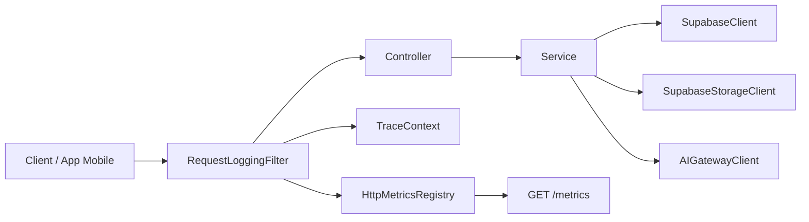

# VidaSync BFF

Backend-for-frontend em Kotlin + Spring Boot para um app de acompanhamento nutricional.

Este README foi reescrito para documentar a arquitetura atual do projeto, explicar como os fluxos acontecem hoje e mapear melhorias com foco em tempo de resposta.

## Objetivo deste documento

Este documento descreve:

- a arquitetura atual do codigo
- como as requests atravessam o sistema
- quais integracoes externas existem hoje
- onde a complexidade esta concentrada
- quais melhorias devem trazer melhor latencia com menor risco

## Stack atual

| Camada | Tecnologia |
| --- | --- |
| Linguagem | Kotlin 2.2.21 |
| Framework | Spring Boot 3.5.0 |
| Runtime | Java 21 |
| HTTP server | spring-boot-starter-web |
| Cliente HTTP | Spring RestClient |
| Banco e persistencia | Supabase REST |
| Storage | Supabase Storage |
| IA | AI Gateway interno |
| Serializacao | Jackson + jackson-module-kotlin |
| Criptografia | BCrypt |
| Observabilidade | logs estruturados + endpoint `/metrics` em formato Prometheus |

## Visao geral da arquitetura atual

Hoje a aplicacao segue majoritariamente este desenho:



Em termos praticos:

1. a request entra no `RequestLoggingFilter`
2. o filtro cria ou reaproveita `X-Request-ID`
3. o controller faz parse do request HTTP e delega para um service
4. o service concentra quase toda a regra de negocio
5. o service conversa diretamente com:
   - `SupabaseClient` para REST no banco
   - `SupabaseStorageClient` para storage
   - `AIGatewayClient` para IA
6. o controller converte o resultado em resposta HTTP
7. o filtro registra metricas e devolve o `X-Request-ID`

## Estrutura atual do projeto

```text
src/main/kotlin/com/vidasync_bff/
|-- client/
|   |-- AIGatewayClient.kt
|   |-- SupabaseClient.kt
|   `-- SupabaseStorageClient.kt
|-- config/
|   |-- AIGatewayConfig.kt
|   |-- CorsConfig.kt
|   |-- JwtAuthFilter.kt
|   |-- RequestLoggingFilter.kt
|   |-- SupabaseConfig.kt
|   `-- UserContext.kt
|-- controller/
|   |-- AuthController.kt
|   |-- ChatController.kt
|   |-- FavoriteController.kt
|   |-- FeedbackController.kt
|   |-- HealthController.kt
|   |-- InternalAdminUsersController.kt
|   |-- MealController.kt
|   |-- MetricsController.kt
|   |-- NutritionController.kt
|   |-- NutritionGoalsController.kt
|   |-- UploadController.kt
|   |-- WaterController.kt
|   `-- WeightController.kt
|-- dto/
|   |-- ai/
|   |-- request/
|   `-- response/
|-- observability/
|   |-- HttpMetricsRegistry.kt
|   `-- TraceContext.kt
|-- service/
|   |-- AuthService.kt
|   |-- ChatService.kt
|   |-- FavoriteService.kt
|   |-- FeedbackService.kt
|   |-- IngredientCacheService.kt
|   |-- InternalAdminUserCloneService.kt
|   |-- MealService.kt
|   |-- NutritionGoalsService.kt
|   |-- NutritionService.kt
|   |-- UploadService.kt
|   |-- WaterService.kt
|   `-- WeightService.kt
`-- VidasyncBffApplication.kt
```

## Mapa funcional atual

| Dominio | Endpoints principais | Service principal | Integracoes externas |
| --- | --- | --- | --- |
| Health | `GET /health` | sem service | nenhuma |
| Metrics | `GET /metrics` | sem service dedicado | nenhuma |
| Upload | `POST /uploads/presign` | `UploadService` | Supabase Storage |
| Auth | `/auth/signup`, `/auth/login`, `/auth/profile`, `/auth/profile/username`, `/auth/profile/password` | `AuthService` | Supabase REST, Supabase Storage |
| Chat | `POST /chat` | `ChatService` | AI Gateway |
| Nutrition | `POST /nutrition/calories` | `NutritionService` | AI Gateway, Supabase REST, Supabase Storage |
| Meals | `/meals` e derivados | `MealService` | Supabase REST, Supabase Storage, NutritionService |
| Favorites | `/favorites` | `FavoriteService` | Supabase REST, Supabase Storage |
| Water | `/water`, `/water/history` | `WaterService` | Supabase REST |
| Nutrition Goals | `/nutrition-goals` | `NutritionGoalsService` | Supabase REST |
| Weight | `/weight` | `WeightService` | Supabase REST |
| Feedback | `/feedback` | `FeedbackService` | Supabase REST |
| Internal Admin Users | `/internal/admin/users/{id}/clone` | `InternalAdminUserCloneService` | Supabase REST |

## Como tudo acontece hoje

### 1. Fluxo transversal de request

Todas as rotas HTTP passam por:

- `RequestLoggingFilter`
  - faz cache do corpo de request e response
  - escreve logs de entrada e saida
  - sanitiza campos sensiveis
  - detecta timeout
  - registra metricas em memoria
- `TraceContext`
  - resolve ou cria `X-Request-ID`
- `HttpMetricsRegistry`
  - acumula contadores e tempos
  - exposto por `GET /metrics`

### 2. Fluxo padrao dos modulos CRUD

Os dominios `auth`, `favorite`, `feedback`, `weight`, `water`, `nutrition-goals` e boa parte de `meal` seguem um padrao parecido:

1. controller recebe request
2. controller faz log e trata excecao HTTP
3. service valida dados
4. service monta `queryParams` e `body` manualmente
5. service chama `SupabaseClient`
6. service traduz rows do Supabase para DTO publico
7. controller devolve `ResponseEntity`

Hoje o `SupabaseClient` e generico. Isso simplifica a infraestrutura, mas empurra para os services a responsabilidade de:

- conhecer tabelas e colunas
- montar filtros REST do Supabase
- interpretar resposta
- decidir insert, patch, delete e ordenacao

### 3. Fluxo de nutricao

`NutritionService` e hoje o ponto mais denso do sistema.

Fluxo atual:

1. recebe `CalorieRequest`
2. resolve a entrada:
   - `foods`
   - `imageUrl`
   - `fileKey`, `imageKey`, `audioKey`, `pdfKey`
   - fallback legado com base64
3. quebra o texto em ingredientes
4. faz lookup no `ingredient_cache`
5. ingredientes sem cache sao enviados ao AI Gateway em paralelo com virtual threads
6. interpreta a resposta do gateway
7. agrega macros, correcoes, warnings e itens invalidos
8. se houver item invalido, o controller transforma isso em `400`

Pontos positivos atuais:

- cache por ingrediente
- paralelismo com Java 21
- suporte a imagem e arquivos assinados
- `traceId` propagado ate o gateway

Pontos de atencao:

- `NutritionService` concentra parsing, regra, integracao, fallback e montagem de resposta
- `IngredientCacheService` tambem age como service e client de infraestrutura
- o controller ainda carrega parte da regra HTTP de itens invalidos

### 4. Fluxo de meals

`MealService` e um orquestrador de persistencia de refeicoes.

Fluxo atual:

1. cria ou atualiza refeicao
2. se `nutrition` nao vier no request, chama `NutritionService.calculateNutrition(...)`
3. se vier imagem base64, sobe para o storage na mesma request
4. persiste em `meals`
5. lista e agrega resumo diario em memoria

Observacao importante:

- o upload de imagem acontece de forma sincrona no hot path da request

### 5. Fluxo de upload

`UploadService` ja representa uma direcao mais performatica:

1. o cliente pede uma URL assinada em `POST /uploads/presign`
2. o backend gera `fileKey` e URL assinada
3. o upload pesado pode acontecer fora do fluxo principal da API de negocio

Esse endpoint e hoje uma base boa para reduzir latencia em outros modulos.

### 6. Fluxo de agua

`WaterService` trabalha com duas tabelas:

- `water_daily_intake`
- `water_intake_events`

Responsabilidades atuais:

- validar request
- resolver data
- herdar meta anterior
- calcular consumo atual
- impedir consumo negativo
- persistir linha diaria
- persistir eventos
- montar panorama e historico
- criar ajuste sintetico para dados legados quando necessario

E um fluxo rico em regra de negocio, mas tambem rico em round trips ao Supabase.

### 7. Fluxo de metas nutricionais

`NutritionGoalsService` usa a tabela `daily_nutrition_goals`.

Hoje ele:

- busca a linha do dia
- busca o valor mais recente por campo:
  - `calories_goal`
  - `protein_goal`
  - `carbs_goal`
  - `fat_goal`
- faz merge com o request atual
- persiste
- rele tudo para montar resposta

Isso preserva a regra de heranca por campo, mas custa varias chamadas REST para uma unica operacao.

### 8. Fluxo interno de clone de usuario

`InternalAdminUserCloneService`:

- valida acesso interno
- carrega perfil, meals e favorites do usuario origem
- gera novo `userId`
- gera username unico
- clona dados
- grava auditoria

Tambem concentra muita regra e conhecimento de schema num unico service.

## Integracoes externas atuais

### Supabase REST

Usado por quase todos os dominios. Hoje a aplicacao usa um client generico:

- `SupabaseClient.get(...)`
- `SupabaseClient.post(...)`
- `SupabaseClient.patch(...)`
- `SupabaseClient.delete(...)`

Vantagem:

- infraestrutura pequena e simples

Desvantagens:

- query params montados manualmente em varios services
- pouca semantica por dominio
- traduzir e otimizar chamadas fica mais dificil

### Supabase Storage

Usado em dois modos:

- upload direto de base64 dentro da request
- geracao de signed URL

Hoje:

- `MealService`, `FavoriteService` e `AuthService` ainda fazem upload sincrono em varias operacoes
- `UploadService` ja usa a abordagem de presigned upload

### AI Gateway

Usado principalmente pelo `NutritionService`.

Caracteristicas atuais:

- chamadas HTTP para pipelines do gateway
- timeout configuravel
- `traceId` propagado
- erros encapsulados em `AIGatewayRequestException`

## Onde a complexidade esta concentrada hoje

### Mistura de responsabilidades

Os services mais densos acumulam no mesmo lugar:

- regra de negocio
- traducao request/response
- detalhes HTTP do Supabase
- tratamento de erro de integracao
- conhecimento de tabela e colunas
- orquestracao de upload

Os maiores exemplos hoje sao:

- `NutritionService`
- `WaterService`
- `InternalAdminUserCloneService`
- `AuthService`

### DTOs publicos e DTOs de integracao misturados

Em varios arquivos de `dto/response`, o projeto mistura:

- DTO publico da API
- row do Supabase
- translator no `companion object`

Exemplos de onde isso acontece:

- `FavoriteResponse.kt`
- `FeedbackResponse.kt`
- `MealResponse.kt`
- `NutritionGoalsResponse.kt`
- `WaterResponse.kt`
- `WeightResponse.kt`

### Controllers ainda fazem parte do tratamento de negocio

Alguns controllers estao finos, mas outros ainda:

- montam envelopes `mapOf(...)`
- traduzem excecoes
- escolhem mensagens HTTP de negocio

Exemplo claro:

- `NutritionController` monta a mensagem amigavel para itens invalidos

### Arquivos mortos ou legados

Hoje existem arquivos que o proprio codigo marca como nao usados:

- `JwtAuthFilter.kt`
- `UserContext.kt`

Isso nao piora a latencia sozinho, mas aumenta ruido arquitetural.

## Mapa de gargalos com impacto em tempo de resposta

| Area | Como funciona hoje | Impacto na latencia | Melhoria sugerida |
| --- | --- | --- | --- |
| Nutrition cache save | `IngredientCacheService.saveBatch` faz um `POST` por ingrediente | medio a alto em requests com muitos misses | trocar para bulk insert/upsert em uma unica chamada |
| Nutrition image/base64 | requests com base64 ainda passam pelo filtro e por uploads inline em alguns fluxos | medio | priorizar `fileKey` e signed upload, reduzir uso de base64 em hot path |
| Nutrition Goals | `POST /nutrition-goals` pode fazer muitas leituras por campo antes e depois de salvar | alto | buscar historico ordenado uma vez e resolver heranca em memoria |
| Water | `upsert` e `getDay` fazem varias leituras e re-leituras da mesma data | medio | reduzir round trips e reaproveitar estado ja carregado |
| Meal/Favorite/Auth uploads | upload de imagem acontece dentro da request | medio a alto | usar o endpoint de presign e enviar so URL ou `fileKey` nos fluxos de negocio |
| Request logging | `RequestLoggingFilter` usa wrappers e loga preview de corpos JSON | medio em payloads grandes | desabilitar preview para rotas com base64 ou payload grande |
| Supabase REST | chamadas por dominio ainda sao montadas manualmente e em serie | medio | criar clients por dominio e reduzir redundancia de consultas |
| AI Gateway | uma chamada por ingrediente sem batch nativo | varia conforme a refeicao | manter paralelismo, mas estudar batch por request se o gateway suportar |

## Melhorias priorizadas para ganhar tempo de resposta

### Fase 1 - ganhos rapidos e baixo risco

1. parar de logar preview de corpo em rotas com base64 ou payload grande
2. transformar o salvamento do `ingredient_cache` em bulk upsert
3. expandir o uso de `POST /uploads/presign` para meal, favorite e profile image
4. revisar timeouts e comportamento de retry do AI Gateway

Resultado esperado:

- menos CPU e memoria por request grande
- menos round trips para cache
- menos tempo bloqueado em upload sincrono

### Fase 2 - reducao de round trips ao Supabase

1. otimizar `NutritionGoalsService` para carregar historico uma vez e resolver heranca em memoria
2. otimizar `WaterService` para evitar reler o mesmo dia apos salvar
3. revisar fluxos que fazem `GET` antes de `PATCH` quando o estado ja esta em memoria

Resultado esperado:

- menor tempo medio por request em dominios CRUD
- menos dependencia de latencia de rede entre app e Supabase

### Fase 3 - organizacao por integracao

Aplicar gradualmente por dominio:

- `dto/request`
- `dto/response`
- request translator
- response translator
- client interface
- client implementation
- integration service interface
- integration service implementation

Prioridade sugerida:

1. `upload`
2. `nutrition-goals`
3. `water`
4. `auth`
5. `favorite`
6. `feedback`
7. `weight`
8. `meal`
9. `internal admin users`

Motivo:

- melhora legibilidade
- reduz acoplamento
- facilita otimizar consultas sem espalhar regra no service principal

### Fase 4 - melhorias estruturais de throughput

1. usar cliente HTTP com pool de conexoes para Supabase e AI Gateway
2. revisar o custo de `ContentCachingRequestWrapper` e `ContentCachingResponseWrapper`
3. separar observabilidade de renderizacao em `metrics`
4. estudar batching no gateway de IA para ingredientes da mesma request

Resultado esperado:

- melhor comportamento sob carga
- menor custo fixo por request
- maior previsibilidade de latencia

## O que ja esta bom hoje

Nem tudo precisa mudar. O projeto ja tem boas bases:

- `UploadService` com presigned upload
- `NutritionService` com virtual threads
- cache de ingredientes
- endpoint `/metrics` util para baseline
- `TraceContext` para correlacao
- separacao inicial entre controllers, services e clients

## Recomendacao pratica de execucao

Se o objetivo principal for melhorar tempo de resposta sem grande risco, a ordem mais segura e:

1. medir latencia atual por endpoint usando `/metrics` e logs
2. atacar uploads sincronos
3. reduzir round trips de `nutrition-goals` e `water`
4. batch no `ingredient_cache`
5. so depois iniciar a refatoracao estrutural por integracao

Assim o projeto ganha performance primeiro e organizacao logo em seguida, sem misturar mudanca funcional com refatoracao estrutural.

## Configuracao local

### Variaveis principais

```properties
AI_GATEWAY_BASE_URL=
AI_GATEWAY_TIMEOUT_MS=120000
AI_GATEWAY_API_KEY=

SUPABASE_URL=
SUPABASE_ANON_KEY=
SUPABASE_SERVICE_ROLE_KEY=

INTERNAL_ADMIN_API_KEY=

SUPABASE_STORAGE_BUCKET=favorite-images
SUPABASE_BUCKET=pipeline-inputs
SUPABASE_SIGNED_DOWNLOAD_TTL_SECONDS=120
SUPABASE_SIGNED_UPLOAD_TTL_SECONDS=900

NUTRITION_CACHE_ENABLED=true
NUTRITION_CACHE_IMAGE_ONLY_ENABLED=false
NUTRITION_AI_FUTURE_TIMEOUT_SECONDS=90
```

### Rodando localmente

```bash
./gradlew bootRun
```

### Endpoints operacionais

- `GET /health`
- `GET /metrics`

## Resumo executivo

Hoje o projeto esta funcional e relativamente simples de operar, mas a maior parte da inteligencia esta concentrada nos services. O principal custo de latencia vem de tres fontes:

- uploads sincronos no hot path
- excesso de round trips ao Supabase em alguns dominios
- fluxo de nutricao com IA e cache ainda muito centralizado

A melhor estrategia para melhorar tempo de resposta e:

- reduzir peso das requests
- diminuir chamadas redundantes ao Supabase
- aproveitar melhor o endpoint de presign
- so depois consolidar a arquitetura por integracao
