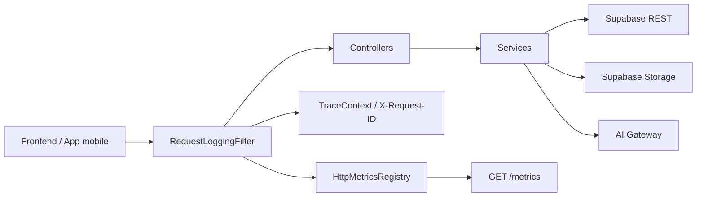
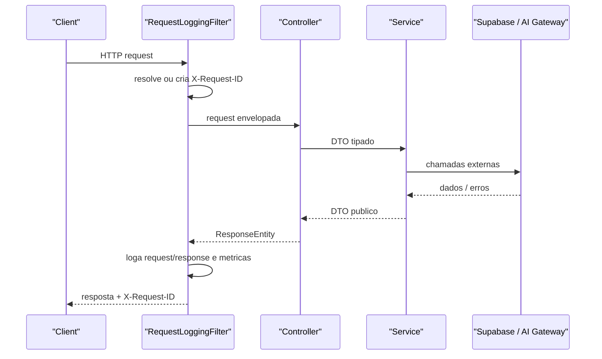
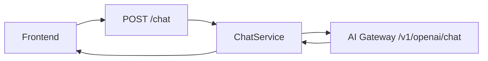
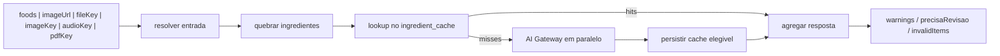
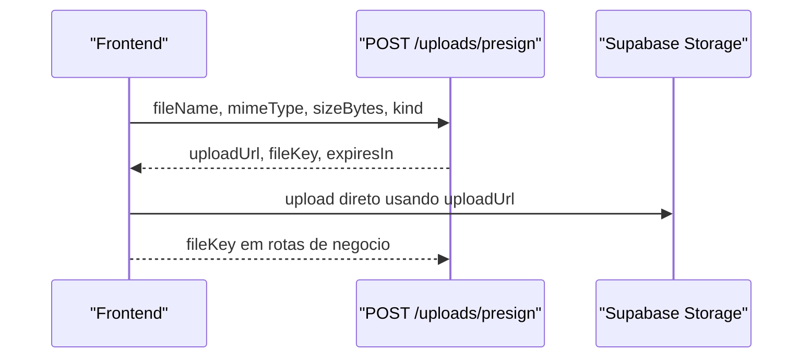

# VidaSync BFF

Backend-for-frontend em Kotlin + Spring Boot para o app VidaSync.

Este repositorio concentra a camada HTTP consumida pelo frontend e orquestra:

- autenticacao e perfil
- chat conversacional com IA
- calculo nutricional por texto, imagem e `fileKey`
- refeicoes, favoritos, agua, metas e peso
- feedback de usuarios
- inbox de notificacoes e publicacao interna
- uploads assinados para o Supabase Storage
- observabilidade via logs estruturados, `X-Request-ID` e `/metrics`

---

## Sumario

- [1. Leitura rapida](#1-leitura-rapida)
- [2. O que o BFF faz](#2-o-que-o-bff-faz)
- [3. Arquitetura em alto nivel](#3-arquitetura-em-alto-nivel)
- [4. Headers, autenticacao e seguranca](#4-headers-autenticacao-e-seguranca)
- [5. Catalogo de endpoints](#5-catalogo-de-endpoints)
- [6. Fluxos principais por dominio](#6-fluxos-principais-por-dominio)
- [7. Mapa de dados no Supabase e buckets](#7-mapa-de-dados-no-supabase-e-buckets)
- [8. Estrutura do projeto](#8-estrutura-do-projeto)
- [9. Documentacao complementar no repo](#9-documentacao-complementar-no-repo)
- [10. Configuracao local](#10-configuracao-local)
- [11. Como rodar localmente](#11-como-rodar-localmente)
- [12. Observabilidade e troubleshooting](#12-observabilidade-e-troubleshooting)
- [13. Testes](#13-testes)
- [14. Tradeoffs atuais e proximos ganhos](#14-tradeoffs-atuais-e-proximos-ganhos)
- [15. Ordem de leitura recomendada](#15-ordem-de-leitura-recomendada)

---

## 1. Leitura rapida

| Item | Valor atual |
| --- | --- |
| Linguagem | Kotlin 2.2.21 |
| Framework | Spring Boot 3.5.0 |
| Runtime | Java 21 |
| Build | Gradle Kotlin DSL |
| Porta padrao | `8080` |
| Persistencia principal | Supabase REST |
| Storage | Supabase Storage |
| Integracao de IA | AI Gateway interno |
| Provider atual da integracao de IA | `feign` por padrao, com provider legado `rest-client` opcional |
| Auth do app | Header `X-User-Id` |
| Correlacao de requests | Header `X-Request-ID` |
| Healthcheck | `GET /health` |
| Metrics | `GET /metrics` em formato Prometheus |

### Resumo executivo

O frontend nao conversa diretamente com Supabase nem com a camada de agentes. Ele chama apenas o BFF. O BFF valida requests, aplica regras de negocio, consulta Supabase, sobe arquivos, chama o AI Gateway e devolve DTOs preparados para a UI.

### O que e importante saber logo de cara

1. Nao usamos JWT no cliente. O app guarda o `userId` retornado em `signup` ou `login` e o reenvia em `X-User-Id`.
2. O endpoint de chat exposto pelo BFF e `POST /chat`, mesmo que por baixo ele chame `/v1/openai/chat` no AI Gateway.
3. O endpoint de nutricao `POST /nutrition/calories` aceita texto, URL de imagem e tambem `fileKey`/`imageKey`/`audioKey`/`pdfKey`.
4. O endpoint `POST /uploads/presign` existe para tirar uploads pesados do hot path das rotas de negocio.
5. O repositorio ja tem guias detalhados de frontend, agua, peso, feedback e notificacoes. Este README funciona como mapa central.

---

## 2. O que o BFF faz

### Papel na arquitetura

O BFF existe para ser a unica porta de entrada HTTP do app.

Ele abstrai:

- detalhes de schema do Supabase
- chaves e cabecalhos internos
- regras de negocio por dominio
- compatibilidade de payloads entre app e AI Gateway
- correlacao de requests e metricas operacionais

### Responsabilidades funcionais

| Dominio | O que o BFF faz hoje |
| --- | --- |
| Auth | cria conta, faz login, busca perfil, atualiza username, senha e imagem |
| Chat | recebe `prompt`, preserva `conversationId`, chama o AI Gateway e devolve memoria resumida |
| Nutrition | interpreta descricao ou midia, usa cache por ingrediente, consulta IA e monta resposta com `precisaRevisao` |
| Meals | cria, lista, resume, atualiza, duplica e remove refeicoes |
| Favorites | persiste e lista refeicoes favoritas |
| Water | salva consumo diario, eventos e historico com heranca de meta |
| Nutrition Goals | salva metas do dia com heranca por campo |
| Weight | registra e lista pesagens |
| Feedback | salva feedback do usuario e expoe listagem para painel admin |
| Notifications | entrega inbox do usuario, marca leitura, faz delete logico e delete fisico em lote |
| Internal Admin | publica notificacoes e clona usuarios para suporte/teste |
| Uploads | gera signed upload URL para o frontend enviar arquivos direto ao storage |

---

## 3. Arquitetura em alto nivel

### Visao geral



### Ciclo de uma request



### Componentes tecnicos principais

| Camada | Componentes | Observacoes |
| --- | --- | --- |
| HTTP | Controllers + Spring MVC | rotas do app e rotas internas |
| Observabilidade | `RequestLoggingFilter`, `TraceContext`, `HttpMetricsRegistry` | log estruturado, `X-Request-ID`, Prometheus text format |
| Negocio | `service/` | regra de negocio concentrada nos services |
| Persistencia | `SupabaseClient` | client generico sobre PostgREST |
| Storage | `SupabaseStorageClient` | upload base64, signed upload e signed download |
| IA | `integration/aigateway/` | provider Feign por padrao; provider legado por `RestClient` ainda existe |

### Integracoes externas

| Integracao | Como e usada hoje |
| --- | --- |
| Supabase REST | leitura, insert, patch e delete das tabelas de negocio |
| Supabase Storage | upload de imagem base64, geracao de signed upload URL e URL publica/download |
| AI Gateway | chat, roteamento IA, pipeline de foto calorias e pipelines auxiliares |

---

## 4. Headers, autenticacao e seguranca

### Headers relevantes

| Header | Onde aparece | Obrigatorio? | Finalidade |
| --- | --- | --- | --- |
| `X-User-Id` | quase todas as rotas de dados | sim na maioria das rotas autenticadas | identifica o usuario do app |
| `X-Internal-Api-Key` | rotas internas/admin e listagem admin de feedback | depende da configuracao | protege operacoes internas |
| `X-Request-ID` | todas as rotas | opcional na entrada, sempre devolvido na saida | correlacao e troubleshooting |

### Modelo de autenticacao do app

- O cliente faz `POST /auth/signup` ou `POST /auth/login`.
- O backend devolve `userId`.
- O app passa a enviar `X-User-Id: <userId>` nas requests autenticadas.
- Nao existe token JWT de sessao no cliente hoje.

### Regras praticas

- `GET /health`, `GET /metrics`, `POST /auth/signup`, `POST /auth/login` e `POST /nutrition/calories` sao publicos.
- `POST /chat` aceita `X-User-Id`, mas nao exige.
- `GET /feedback` e uma rota de painel/admin, apesar do path nao comecar com `/internal`.
- Algumas rotas internas exigem `X-Internal-Api-Key` apenas se `INTERNAL_ADMIN_API_KEY` estiver configurada.

### Sanitizacao e seguranca operacional

O `RequestLoggingFilter` faz sanitizacao de campos sensiveis em logs para chaves como:

- `authorization`
- `token`
- `api_key`
- `apikey`
- `password`
- `secret`

Tambem evita preview de corpo para conteudos binarios como:

- `multipart/*`
- `image/*`
- `audio/*`
- `video/*`
- `application/pdf`
- `application/octet-stream`

---

## 5. Catalogo de endpoints

### 5.1 Publicos e de baixo atrito

| Metodo | Rota | Auth | Uso principal |
| --- | --- | --- | --- |
| `GET` | `/health` | publica | healthcheck simples |
| `GET` | `/metrics` | publica | metricas HTTP em formato Prometheus |
| `POST` | `/auth/signup` | publica | cria conta e devolve `userId` |
| `POST` | `/auth/login` | publica | autentica por username/senha |
| `POST` | `/nutrition/calories` | publica | calcula macros por texto, imagem ou `fileKey` |
| `POST` | `/chat` | `X-User-Id` opcional | conversa com o agente via AI Gateway |

### 5.2 Rotas autenticadas do usuario

| Metodo | Rota | Auth | Uso principal |
| --- | --- | --- | --- |
| `GET` | `/auth/profile` | `X-User-Id` | busca perfil atual |
| `PUT` | `/auth/profile` | `X-User-Id` | atualiza username, senha e/ou foto |
| `PUT` | `/auth/profile/username` | `X-User-Id` | troca username |
| `PUT` | `/auth/profile/password` | `X-User-Id` | troca senha com validacao da atual |
| `POST` | `/uploads/presign` | `X-User-Id` | gera signed upload URL |
| `POST` | `/meals` | `X-User-Id` | cria refeicao |
| `GET` | `/meals?date=YYYY-MM-DD` | `X-User-Id` | lista refeicoes do dia |
| `GET` | `/meals/summary?date=YYYY-MM-DD` | `X-User-Id` | resumo do dia com totais |
| `GET` | `/meals/range?startDate=...&endDate=...` | `X-User-Id` | lista periodo |
| `PUT` | `/meals/{id}` | `X-User-Id` | atualiza refeicao |
| `DELETE` | `/meals/{id}` | `X-User-Id` | remove refeicao |
| `POST` | `/meals/{id}/duplicate` | `X-User-Id` | duplica refeicao |
| `POST` | `/favorites` | `X-User-Id` | cria favorito |
| `GET` | `/favorites` | `X-User-Id` | lista favoritos |
| `DELETE` | `/favorites/{id}` | `X-User-Id` | remove favorito |
| `POST` | `/water` | `X-User-Id` | define meta e/ou soma/remove agua |
| `GET` | `/water?date=YYYY-MM-DD` | `X-User-Id` | panorama do dia |
| `GET` | `/water/history?startDate=...&endDate=...` | `X-User-Id` | historico por periodo |
| `POST` | `/nutrition-goals` | `X-User-Id` | salva metas nutricionais do dia |
| `GET` | `/nutrition-goals?date=YYYY-MM-DD` | `X-User-Id` | busca metas efetivas do dia |
| `POST` | `/weight` | `X-User-Id` | registra novo peso |
| `GET` | `/weight` | `X-User-Id` | lista historico de peso |
| `POST` | `/feedback` | `X-User-Id` | envia feedback para desenvolvedores |
| `GET` | `/notifications` | `X-User-Id` | carrega inbox do usuario |
| `POST` | `/notifications/read` | `X-User-Id` | marca notificacoes como lidas |
| `POST` | `/notifications/delete` | `X-User-Id` | delete logico de notificacoes |
| `DELETE` | `/notifications` | `X-User-Id` | delete fisico de todas as notificacoes do usuario |

### 5.3 Rotas de painel interno e administracao

| Metodo | Rota | Auth | Uso principal |
| --- | --- | --- | --- |
| `GET` | `/feedback` | `X-User-Id` e `X-Internal-Api-Key` se configurada | lista feedbacks para painel admin |
| `POST` | `/internal/admin/notifications` | `X-Internal-Api-Key` se configurada | publica notificacao para um usuario |
| `POST` | `/internal/admin/notifications/broadcast` | `X-User-Id` para auditoria e `X-Internal-Api-Key` se configurada | broadcast para todos os usuarios |
| `POST` | `/internal/admin/users/{id}/clone?dry_run=true|false` | `X-User-Id` para auditoria e `X-Internal-Api-Key` se configurada | clona usuario, refeicoes e favoritos |

### Notas importantes do catalogo

- `POST /chat` recebe somente `prompt` e `conversationId` no BFF.
- `POST /nutrition/calories` aceita os aliases `image_url`, `imageUrl`, `file_key`, `fileKey`, `image_key`, `audio_key`, `pdf_key` e similares.
- `POST /notifications/delete` faz delete logico.
- `DELETE /notifications` remove fisicamente todas as notificacoes do usuario.
- `POST /internal/admin/users/{id}/clone` usa `dry_run=true` por padrao.

---

## 6. Fluxos principais por dominio

### 6.1 Auth e perfil

#### Como funciona hoje

- `signup` valida username e senha.
- A senha e salva como `BCrypt`.
- O `userId` e um UUID gerado pelo backend.
- `profileImage` pode vir em base64 e, se vier, o backend tenta subir para o storage.
- `login` consulta `user_profiles` por username e valida o hash.

#### Regras principais

- username: somente letras e numeros, entre 3 e 30 caracteres
- senha: minimo de 6 caracteres
- `updateProfile` aceita alteracao parcial
- `changePassword` exige `currentPassword`

### 6.2 Chat

#### Fluxo atual



#### Contrato do BFF

Body aceito:

```json
{
  "prompt": "preciso beber mais agua?",
  "conversationId": "opcional"
}
```

#### O que o BFF devolve

- `response`
- `model`
- `conversationId`
- `intent`
- `confidence`
- `needsReview`
- `warnings`
- `memory`
- `disclaimer`
- `traceId`

#### Observacoes

- O BFF nao expoe `/v1/openai/chat` diretamente para o app.
- O `conversationId` deve ser guardado no frontend para manter contexto entre turnos.
- O `traceId` devolvido e o melhor identificador para troubleshooting.

### 6.3 Nutrition / calorias

#### Entradas aceitas

O endpoint `POST /nutrition/calories` aceita:

- `foods`
- `image` em base64
- `imageUrl`
- `fileKey`
- `imageKey`
- `audioKey`
- `pdfKey`

#### Fluxo atual



#### O que esse fluxo faz

- resolve imagem direta, URL, chave de storage ou fallback legado base64
- quebra texto em ingredientes
- usa cache por ingrediente quando habilitado
- chama a IA em paralelo com virtual threads para misses
- soma macros
- gera `corrections`, `warnings`, `invalidItems` e `precisaRevisao`

#### Comportamento de erro

- se houver itens invalidos, o controller devolve `400`
- se a IA falhar num ingrediente, o BFF retorna um resultado com revisao pendente em vez de explodir o request inteiro
- em fluxo so de imagem, um `422` do pipeline pode virar mensagem amigavel de "nao foi possivel identificar comida"

### 6.4 Meals

#### Como funciona hoje

- se o request ja trouxer `nutrition`, o backend usa os macros enviados
- se `nutrition` nao vier, o backend chama `NutritionService.calculateNutrition(...)`
- `time` e opcional; se nao vier, usa horario atual
- `image` base64 pode ser enviada diretamente no body
- `imageUrl` tambem pode ser enviada em update

#### Observacao importante

O upload de imagem em refeicoes ainda acontece de forma sincrona quando a imagem vem em base64. O caminho recomendado para reduzir latencia e usar `POST /uploads/presign` e depois mandar `fileKey`/URL no fluxo de negocio.

### 6.5 Favorites

#### Como funciona hoje

- persiste em `favorite_meals`
- aceita `nutrition` opcional
- aceita imagem base64 opcional
- lista por `created_at desc`

#### Observacao

Hoje o upload de imagem de favorito tambem pode acontecer dentro da request.

### 6.6 Uploads assinados

#### Fluxo recomendado



#### Regras do endpoint

- exige `X-User-Id`
- aceita `kind` como `image`, `audio`, `pdf`, `document`, `video` ou cai para `file`
- valida `sizeBytes` entre `1` e `50MB`
- usa o bucket configurado em `SUPABASE_BUCKET`, padrao `pipeline-inputs`

### 6.7 Water

#### Como funciona hoje

- usa `water_daily_intake` para o saldo consolidado do dia
- usa `water_intake_events` para o historico de movimentos
- `goalMl` define ou atualiza meta
- `deltaMl` soma ou remove agua
- o saldo nunca fica negativo
- o backend herda a ultima meta conhecida quando o dia atual ainda nao tem uma propria

#### Respostas do dominio

- `GET /water` devolve `water: null` se nao houver nada para o usuario
- `GET /water/history` pode comecar automaticamente no primeiro dia relevante
- dias sem linha explicita podem aparecer com meta herdada

### 6.8 Nutrition goals

#### Como funciona hoje

- usa `daily_nutrition_goals`
- herda metas por campo individual:
  - `calories_goal`
  - `protein_goal`
  - `carbs_goal`
  - `fat_goal`
- salvar uma data nao retroage para datas anteriores

#### Regra importante

`POST /nutrition-goals` precisa receber pelo menos uma meta e nenhuma meta pode ser negativa.

### 6.9 Weight

#### Como funciona hoje

- persiste em `weight_entries`
- registra apenas o peso atual
- ordena historico por `measured_at asc`
- rejeita `weightKg <= 0`

### 6.10 Feedback

#### Como funciona hoje

- `POST /feedback` salva feedback do usuario na tabela `developer_feedback`
- `GET /feedback` lista tudo para uso administrativo
- `INTERNAL_ADMIN_API_KEY` protege a listagem se estiver configurada

#### Campos mais importantes do feedback

- `userId`
- `userName`
- `message`
- `imageUrl`
- `status`
- `developerResponse`
- `respondedAt`
- `respondedBy`

### 6.11 Notifications

#### O que existe hoje

- inbox do usuario com `GET /notifications`
- marcar lidas com `POST /notifications/read`
- delete logico com `POST /notifications/delete`
- delete fisico total com `DELETE /notifications`
- publicacao admin para um usuario ou broadcast

#### Regras importantes

- `notificationIds` e `markAll=true` sao mutuamente exclusivos nos endpoints de mutacao
- `POST /notifications/delete` nao remove a linha do banco; grava `is_deleted=true`
- `DELETE /notifications` remove todas as linhas do usuario
- broadcast procura todos os `user_id` em `user_profiles`
- `actionLabel` e `actionRoute` devem ser informados juntos

### 6.12 Internal admin clone

#### O que essa operacao faz

- valida acesso interno
- carrega `user_profiles`, `meals` e `favorite_meals` do usuario origem
- gera um novo `userId`
- gera username unico para o clone
- copia perfil, refeicoes e favoritos
- grava auditoria em `user_clone_audit`

#### Regras de seguranca

- `dry_run=true` por padrao
- a senha do usuario original nao e copiada
- um hash aleatorio novo e gerado para o clone quando a coluna existe
- a rota exige `X-User-Id` para auditoria

---

## 7. Mapa de dados no Supabase e buckets

### Tabelas mais usadas

| Dominio | Tabelas principais |
| --- | --- |
| Auth | `user_profiles` |
| Meals | `meals` |
| Favorites | `favorite_meals` |
| Nutrition cache | `ingredient_cache` |
| Water | `water_daily_intake`, `water_intake_events` |
| Nutrition goals | `daily_nutrition_goals` |
| Weight | `weight_entries` |
| Feedback | `developer_feedback` |
| Notifications | `notifications` |
| Internal clone | `user_clone_audit` |

### Buckets e usos

| Uso | Bucket |
| --- | --- |
| imagens de perfil e favoritos | `SUPABASE_STORAGE_BUCKET`, padrao `favorite-images` |
| uploads assinados para pipelines | `SUPABASE_BUCKET`, padrao `pipeline-inputs` |
| imagens de refeicoes | `meal-images` |

### Onde ficam as migracoes

- `supabase/` contem a estrutura de migracoes do projeto
- `supabase-migrations.sql` consolida SQL util para evolucao de tabelas
- `supabase/.temp/openapi.json` e um snapshot de introspeccao util para desenvolvimento

---

## 8. Estrutura do projeto

```text
.
|-- bruno-collection/                # requests para testes manuais
|-- build.gradle.kts                 # dependencias e plugins
|-- FRONTEND_API_GUIDE.md            # contrato principal para o frontend
|-- FRONTEND_AUTH_GUIDE.md           # auth por X-User-Id
|-- TUTORIAL_AGUA_E_METAS_DO_DIA.md  # agua + metas nutricionais
|-- TUTORIAL_FEEDBACK_DESENVOLVEDORES.md
|-- TUTORIAL_NOTIFICACOES.md
|-- TUTORIAL_PESO.md
|-- VIDASYNC_BFA_ARCHITECTURE.md
|-- src/
|   |-- main/
|   |   |-- kotlin/com/vidasync_bff/
|   |   |   |-- client/             # clients HTTP de Supabase e AI Gateway legado
|   |   |   |-- config/             # beans, CORS, logging filter
|   |   |   |-- controller/         # endpoints HTTP
|   |   |   |-- dto/                # requests e responses publicos
|   |   |   |-- integration/        # integracao tipada com AI Gateway
|   |   |   |-- observability/      # metricas e trace context
|   |   |   `-- service/            # regra de negocio
|   |   `-- resources/
|   |       `-- application.properties
|   `-- test/kotlin/com/vidasync_bff/ # testes de controllers, services e translators
`-- supabase/
    `-- migrations/
```

### Arquivos que merecem leitura cedo

| Arquivo | Por que olhar |
| --- | --- |
| `src/main/resources/application.properties` | configuracao efetiva e defaults |
| `src/main/kotlin/com/vidasync_bff/config/RequestLoggingFilter.kt` | request lifecycle, logs e metricas |
| `src/main/kotlin/com/vidasync_bff/service/NutritionService.kt` | modulo mais complexo de negocio |
| `src/main/kotlin/com/vidasync_bff/service/NotificationService.kt` | inbox, delete logico, broadcast |
| `src/main/kotlin/com/vidasync_bff/service/WaterService.kt` | heranca de meta + eventos |
| `src/main/kotlin/com/vidasync_bff/service/MealService.kt` | orquestracao de refeicoes + integracao com nutricao |

---

## 9. Documentacao complementar no repo

Use este README como mapa central e os arquivos abaixo como guias especializados.

| Documento | Quando consultar |
| --- | --- |
| [FRONTEND_API_GUIDE.md](./FRONTEND_API_GUIDE.md) | contrato geral entre frontend e BFF |
| [FRONTEND_AUTH_GUIDE.md](./FRONTEND_AUTH_GUIDE.md) | onboarding de auth e uso do `X-User-Id` |
| [TUTORIAL_AGUA_E_METAS_DO_DIA.md](./TUTORIAL_AGUA_E_METAS_DO_DIA.md) | agua e metas nutricionais |
| [TUTORIAL_FEEDBACK_DESENVOLVEDORES.md](./TUTORIAL_FEEDBACK_DESENVOLVEDORES.md) | fluxo de feedback e painel de dev |
| [TUTORIAL_NOTIFICACOES.md](./TUTORIAL_NOTIFICACOES.md) | inbox, mutacoes e publicacao admin |
| [TUTORIAL_PESO.md](./TUTORIAL_PESO.md) | fluxo de peso corporal |
| [VIDASYNC_BFA_ARCHITECTURE.md](./VIDASYNC_BFA_ARCHITECTURE.md) | leitura arquitetural e hotspots de performance |

### Ferramentas auxiliares no repo

- `bruno-collection/`: colecao para execucao manual de requests
- `build/reports/tests/test/`: relatorios HTML de testes apos rodar Gradle
- `build/reports/problems/`: relatorios de problemas do build quando gerados

---

## 10. Configuracao local

### Como a configuracao e carregada

O Spring importa:

- `.env.properties`
- `vidasync-bff/.env.properties`

### Variaveis de ambiente e properties

| Variavel | Obrigatoria? | Default | Uso |
| --- | --- | --- | --- |
| `PORT` | nao | `8080` | porta HTTP |
| `AI_GATEWAY_BASE_URL` | sim para fluxos de IA | `https://vidasync-multiagents-ia-production.up.railway.app` | base URL do AI Gateway |
| `AI_GATEWAY_TIMEOUT_MS` | nao | `120000` | timeout das chamadas de IA |
| `AI_GATEWAY_API_KEY` | nao | vazio | enviado como `X-Internal-Api-Key` no RestClient legado |
| `AI_GATEWAY_PROVIDER` | nao | `feign` | provider da integracao de IA |
| `SUPABASE_URL` | sim | vazio | base URL do projeto Supabase |
| `SUPABASE_ANON_KEY` | sim, a menos que use service role | vazio | auth do Supabase REST e Storage |
| `SUPABASE_SERVICE_ROLE_KEY` | recomendado | vazio | auth privilegiada para REST/Storage |
| `SUPABASE_STORAGE_BUCKET` | nao | `favorite-images` | bucket padrao de imagem de perfil/favoritos |
| `SUPABASE_BUCKET` | nao | `pipeline-inputs` | bucket de uploads assinados/pipelines |
| `SUPABASE_SIGNED_DOWNLOAD_TTL_SECONDS` | nao | `120` | TTL de signed download URL |
| `SUPABASE_SIGNED_UPLOAD_TTL_SECONDS` | nao | `900` | TTL de signed upload URL |
| `NUTRITION_CACHE_ENABLED` | nao | `true` | habilita cache de ingredientes |
| `NUTRITION_CACHE_IMAGE_ONLY_ENABLED` | nao | `false` | permite cache tambem para requests so com imagem |
| `NUTRITION_AI_FUTURE_TIMEOUT_SECONDS` | nao | `90` | timeout por chamada paralela de IA em nutricao |
| `INTERNAL_ADMIN_API_KEY` | nao | vazio | protege operacoes internas/admin |
| `CORS_ALLOWED_ORIGIN_PATTERNS` | nao | `http://localhost:*,http://127.0.0.1:*` | CORS para web/local |

### Exemplo minimo de `.env.properties`

```properties
AI_GATEWAY_BASE_URL=https://seu-ai-gateway
AI_GATEWAY_TIMEOUT_MS=120000
AI_GATEWAY_PROVIDER=feign

SUPABASE_URL=https://seu-projeto.supabase.co
SUPABASE_ANON_KEY=seu-anon-key
SUPABASE_SERVICE_ROLE_KEY=sua-service-role-key

SUPABASE_STORAGE_BUCKET=favorite-images
SUPABASE_BUCKET=pipeline-inputs
SUPABASE_SIGNED_DOWNLOAD_TTL_SECONDS=120
SUPABASE_SIGNED_UPLOAD_TTL_SECONDS=900

NUTRITION_CACHE_ENABLED=true
NUTRITION_CACHE_IMAGE_ONLY_ENABLED=false
NUTRITION_AI_FUTURE_TIMEOUT_SECONDS=90

INTERNAL_ADMIN_API_KEY=
CORS_ALLOWED_ORIGIN_PATTERNS=http://localhost:*,http://127.0.0.1:*
```

### Outros defaults relevantes de runtime

- `spring.servlet.multipart.max-file-size=10MB`
- `spring.servlet.multipart.max-request-size=10MB`

Observacao: o endpoint `POST /uploads/presign` valida `sizeBytes` ate `50MB`, porque o upload em si acontece direto no storage, fora do corpo HTTP do BFF.

---

## 11. Como rodar localmente

### Pre-requisitos

- Java 21
- acesso ao projeto Supabase
- acesso ao AI Gateway

### Rodar a aplicacao

macOS / Linux:

```bash
./gradlew bootRun
```

Windows PowerShell:

```powershell
.\gradlew.bat bootRun
```

### Endpoints operacionais para smoke test

```bash
curl http://localhost:8080/health
curl http://localhost:8080/metrics
```

### Build do projeto

macOS / Linux:

```bash
./gradlew build
```

Windows PowerShell:

```powershell
.\gradlew.bat build
```

---

## 12. Observabilidade e troubleshooting

### Correlacao

- toda request recebe ou reaproveita `X-Request-ID`
- o mesmo valor entra no `MDC` como `trace_id`
- esse valor tambem e propagado para o AI Gateway

### Logs HTTP

O `RequestLoggingFilter` registra:

- metodo
- path
- query
- IP do cliente
- content type
- content length
- preview sanitizado do body
- status
- duracao
- timeout

### Metrics

`GET /metrics` devolve texto no formato Prometheus com as metricas:

- `bff_http_requests_total`
- `bff_http_request_duration_ms_sum`
- `bff_http_request_duration_ms_count`
- `bff_http_timeouts_total`

### CORS

O `CorsConfig`:

- libera metodos `GET`, `POST`, `PUT`, `PATCH`, `DELETE`, `OPTIONS`
- expoe `X-Request-ID` e `X-Trace-Id`
- usa padrao local `localhost` e `127.0.0.1` se nada for configurado

### Dicas praticas de troubleshooting

1. Se o frontend recebeu erro estranho, cheque o `X-Request-ID`.
2. Se o problema envolver IA, procure o mesmo trace nos logs do BFF e do AI Gateway.
3. Se um fluxo com imagem estiver lento, verifique se o cliente ainda esta mandando base64 em vez de upload assinado.
4. Se uma rota interna falhar com `401`, confirme `INTERNAL_ADMIN_API_KEY`.

---

## 13. Testes

### Como rodar

macOS / Linux:

```bash
./gradlew test
```

Windows PowerShell:

```powershell
.\gradlew.bat test
```

### Onde os testes ficam

- `src/test/kotlin/com/vidasync_bff/controller/`
- `src/test/kotlin/com/vidasync_bff/service/`
- `src/test/kotlin/com/vidasync_bff/integration/`
- `src/test/kotlin/com/vidasync_bff/observability/`

### O que a suite cobre hoje

- controllers principais
- services de negocio selecionados
- translators da integracao com AI Gateway
- observabilidade e metricas

---

## 14. Tradeoffs atuais e proximos ganhos

O projeto esta funcional e organizado o suficiente para evoluir, mas ainda ha alguns pontos importantes a conhecer.

| Tema | Como esta hoje | Impacto |
| --- | --- | --- |
| Uploads base64 em hot path | auth, favorites e meals ainda aceitam upload inline | aumenta latencia e peso da request |
| `NutritionService` | concentra parsing, cache, IA, fallback e agregacao | modulo mais complexo do sistema |
| `WaterService` e `NutritionGoalsService` | fazem varias consultas ao Supabase para resolver heranca | custo extra de round trip |
| `SupabaseClient` generico | deixa services conhecerem detalhes de tabela e filtro | menos semantica por dominio |
| dupla integracao com IA | provider Feign atual + provider legado RestClient | compatibilidade boa, mas aumenta superficie |
| arquivos legados | `JwtAuthFilter.kt` e `UserContext.kt` ainda existem | ruido arquitetural |

### Melhorias mais promissoras

1. empurrar uploads grandes para `POST /uploads/presign`
2. reduzir round trips de agua e metas nutricionais
3. fazer bulk upsert mais agressivo no cache de ingredientes
4. seguir separando integracoes por dominio
5. simplificar superficies legadas da integracao com IA

---

## 15. Ordem de leitura recomendada

Se voce esta chegando agora no projeto, a sequencia mais eficiente e:

1. este `README.md`
2. [FRONTEND_API_GUIDE.md](./FRONTEND_API_GUIDE.md)
3. [FRONTEND_AUTH_GUIDE.md](./FRONTEND_AUTH_GUIDE.md)
4. `src/main/resources/application.properties`
5. `src/main/kotlin/com/vidasync_bff/config/RequestLoggingFilter.kt`
6. `src/main/kotlin/com/vidasync_bff/service/NutritionService.kt`
7. `src/main/kotlin/com/vidasync_bff/service/NotificationService.kt`
8. [VIDASYNC_BFA_ARCHITECTURE.md](./VIDASYNC_BFA_ARCHITECTURE.md)

### Se voce for trabalhar em um dominio especifico

- chat: `ChatController`, `ChatService`, `integration/aigateway/`
- nutricao: `NutritionController`, `NutritionService`, `IngredientCacheService`
- refeicoes: `MealController`, `MealService`
- agua: `WaterController`, `WaterService`
- notificacoes: `NotificationController`, `InternalAdminNotificationsController`, `NotificationService`
- auth: `AuthController`, `AuthService`

---

## Encerramento

Este README foi pensado para servir como:

- mapa de onboarding
- referencia de arquitetura atual
- inventario de endpoints
- guia de configuracao local
- indice para a documentacao detalhada do repositorio

Se voce encontrar divergencia entre README e codigo, o codigo deve ser tratado como fonte de verdade. O objetivo desta documentacao e reduzir esse gap o maximo possivel.
